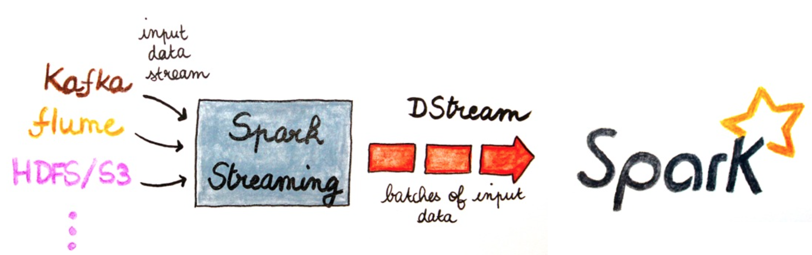
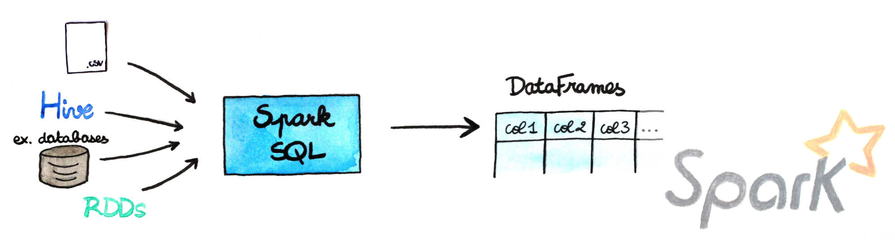

# Workshop spark-in-practice

In this workshop the exercises are focused on using the [Spark core](https://spark.apache.org/docs/1.4.0/programming-guide.html) and [Spark Streaming](https://spark.apache.org/docs/1.4.0/streaming-programming-guide.html) APIs, and also the [dataFrame](https://spark.apache.org/docs/1.4.0/sql-programming-guide.html) on data processing.
Exercises are available both in [Java](https://github.com/nivdul/spark-in-practice) and Scala on my github account (here in scala). You just have to clone the project and go! 
If you need help, take a look at the solution branch.

The original blog-post is right [here](http://www.duchess-france.org/starting-with-spark-in-practice/).

To help you to implement each class, unit tests are in.

Frameworks used:

* Spark 1.4.0
* scala 2.10
* sbt
* scalatest

All exercises runs in local mode as a standalone program.

To work on the hands-on, retrieve the code via the following command line:
<pre><code>$ git clone https://github.com/nivdul/spark-in-practice-scala.git</code></pre>

Then you can import the project in IntelliJ or Eclipse (add the SBT and Scala plugins for Scala), or use sublime text for example.

If you want to use the interactive spark-shell (only scala/python), you need to download a [binary Spark distribution](https://spark.apache.org/downloads.html).

<pre><code>Go to the Spark directory
$ cd /spark-1.4.0

First build the project
$ build/mvn -DskipTests clean package

Launch the spark-shell
$ ./bin/spark-shell
scala>
</code></pre>

## Part 1: Spark core API
To be more familiar with the Spark API, you will start by implementing the wordcount example (Ex0).
After that we use reduced tweets as the data along a json format for data mining (Ex1-Ex3).

In these exercises you will have to:

* Find all the tweets by user
* Find how many tweets each user has
* Find all the persons mentioned on tweets
* Count how many times each person is mentioned
* Find the 10 most mentioned persons
* Find all the hashtags mentioned on a tweet
* Count how many times each hashtag is mentioned
* Find the 10 most popular Hashtags

The last exercise (Ex4) is a way more complicated: the goal is to build an inverted index knowing that an inverted is the data structure used to build search engines. 
Assuming #spark is a hashtag that appears in tweet1, tweet3, tweet39, the inverted index will be a Map that contains a (key, value) pair as (#spark, List(tweet1,tweet3, tweet39)).

## Part 2: streaming analytics with Spark Streaming
Spark Streaming is a component of Spark to process live data streams in a scalable, high-throughput and fault-tolerant way.

In fact Spark Streaming receives live input data streams and divides the data into batches, which are then processed by the Spark engine to generate the final stream of results in batches.
The abstraction, which represents a continuous stream of data is the DStream (discretized stream).

In the workshop, Spark Streaming is used to process a live stream of Tweets using twitter4j, a library for the Twitter API.
To be able to read the firehose, you will need to create a Twitter application at http://apps.twitter.com, get your credentials, and add it in the StreamUtils class.

In this exercise you will have to:

* Print the status of each tweet
* Find the 10 most popular Hashtag

## Part 3: structured data with the DataFrame
A DataFrame is a distributed collection of data organized into named columns. It is conceptually equivalent to a table in a relational database or a data frame in R/Python, but with richer optimizations under the hood.
DataFrames can be constructed from different sources such as: structured data files, tables in Hive, external databases, or existing RDDs.

In the exercise you will have to:

* Print the dataframe
* Print the schema of the dataframe
* Find people who are located in Paris
* Find the user who tweets the more

## Conclusion
If you find better way/implementation, do not hesitate to send a pull request or open an issue.

Here are some useful links around Spark and its ecosystem:

* [Apache Spark website](https://spark.apache.org/docs/1.4.0/programming-guide.html)
* [Spark Streaming documentation](https://spark.apache.org/docs/1.4.0/streaming-programming-guide.html)
* [Spark SQL and DataFrame documentation](https://spark.apache.org/docs/1.4.0/sql-programming-guide.html)
* [Databricks blog](https://databricks.com/blog )
* [Analyze data from an accelerometer using Spark, Cassandra and MLlib](http://www.duchess-france.org/analyze-accelerometer-data-with-apache-spark-and-mllib/)

